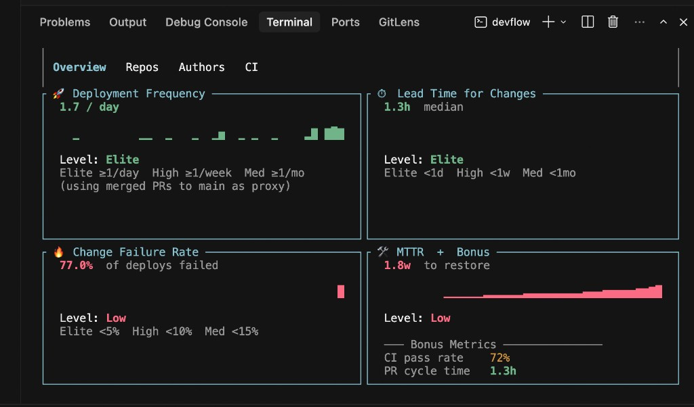
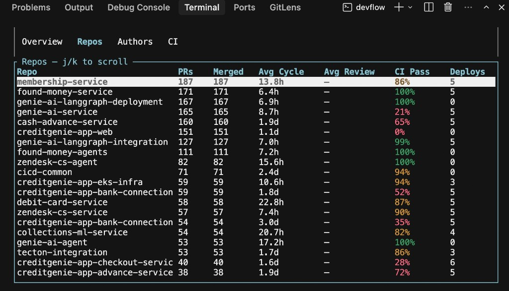
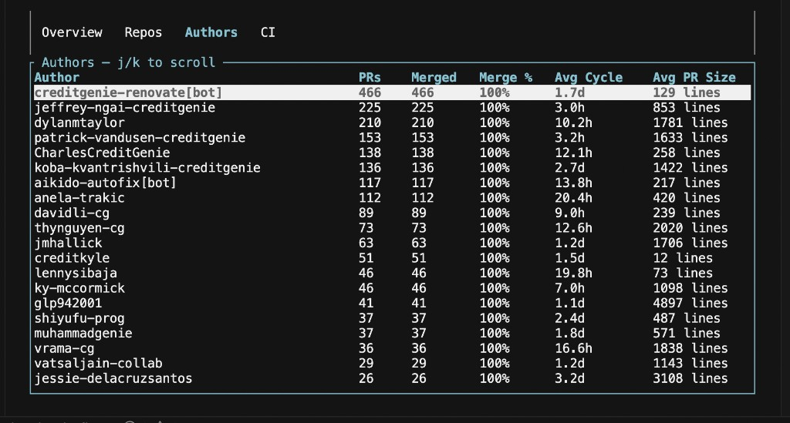
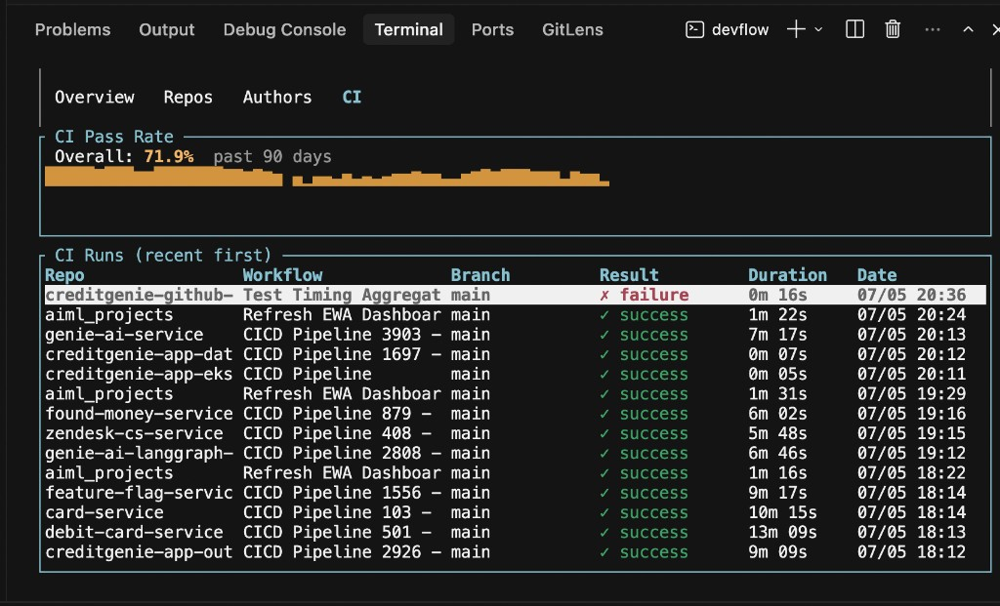

# devflow

Terminal DORA metrics dashboard for GitHub teams.

Pulls PR, deployment, and CI data from a GitHub org (or user) and renders DORA metrics plus team breakdowns in your terminal.

## Screenshots

### Overview — DORA metrics at a glance



### Repos — per-repo breakdown



### Authors — contributor stats



### CI — pass rate and recent runs



## Metrics

- **Deployment frequency** (merged PRs to main as proxy when deploy data is sparse)
- **Lead time for changes**
- **Change failure rate**
- **Mean time to recovery (MTTR)**
- Bonus: PR cycle time, review turnaround, CI pass rate, median PR size

Tabs: **Overview · Repos · Authors · CI**

## Quick start

### 1. Download or build

**Prebuilt macOS binary** (Apple Silicon + Intel): see [Releases](https://github.com/kumarsaheb1/devflow/releases).

Or build from source (requires [Rust](https://rustup.rs)):

```bash
git clone https://github.com/kumarsaheb1/devflow.git
cd devflow
cargo build --release -p devflow
# binary at target/release/devflow
```

### 2. Configure

```bash
cp .env.example .env
```

Edit `.env`:

```env
GITHUB_TOKEN=ghp_...          # needs: repo, read:org, read:user
GITHUB_OWNER=your-org         # org or username to analyse
GITHUB_REPOS=                 # optional: comma-separated repo names (blank = auto-discover)
DEVFLOW_LOOKBACK_DAYS=90
```

Each person should use their **own** GitHub personal access token. Do not commit `.env`.

### 3. Run

```bash
./devflow
```

**Demo mode** (fake data, no token/network):

```bash
./devflow --demo
```

### macOS Gatekeeper

If macOS blocks the downloaded binary:

```bash
xattr -d com.apple.quarantine devflow
```

## Controls

| Key | Action |
|-----|--------|
| `Tab` / `l` | Next tab |
| `Shift+Tab` / `h` | Previous tab |
| `j` / `k` or arrows | Scroll |
| `r` | Refresh data |
| `q` / `Ctrl+C` | Quit |

## Rate limits

GitHub personal tokens are capped at **5,000 requests/hour**. Scanning many repos with 90 days of history can use a lot of quota. If you hit a 403 rate-limit error, wait for the reset or narrow `GITHUB_REPOS` to fewer repos.

## License

MIT
